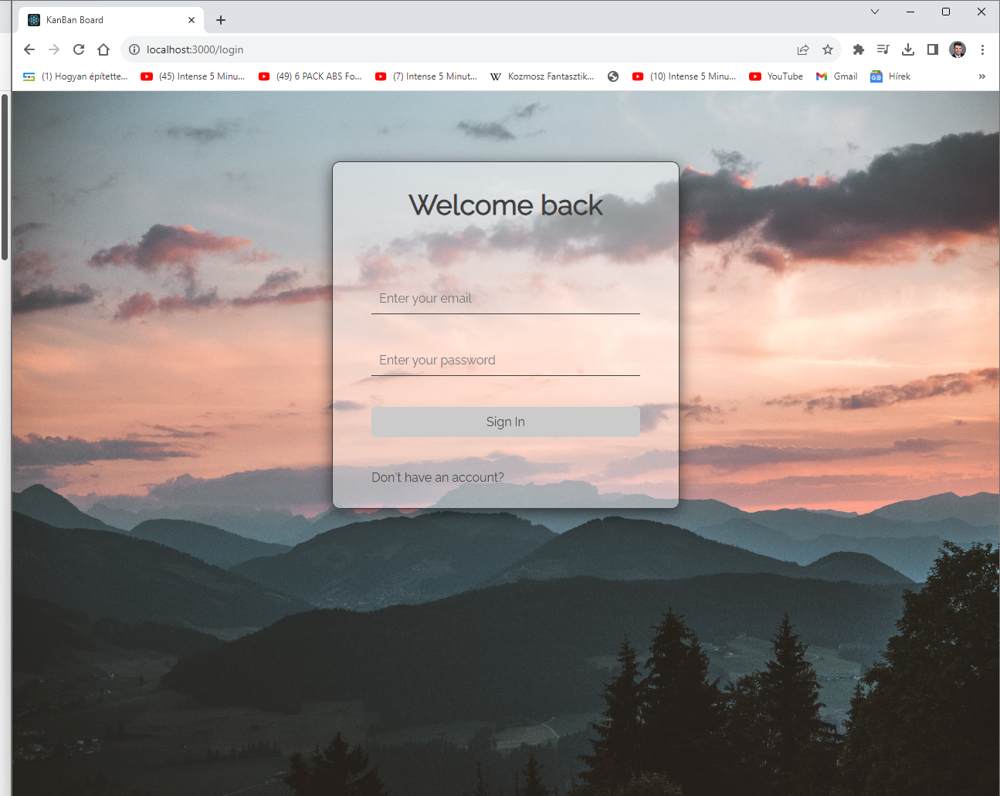
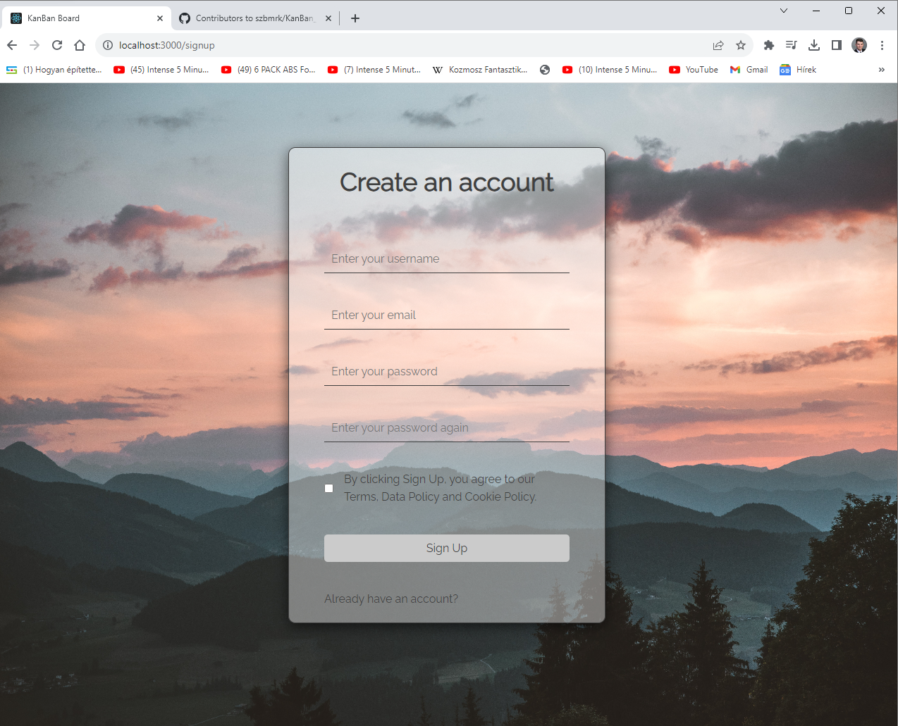
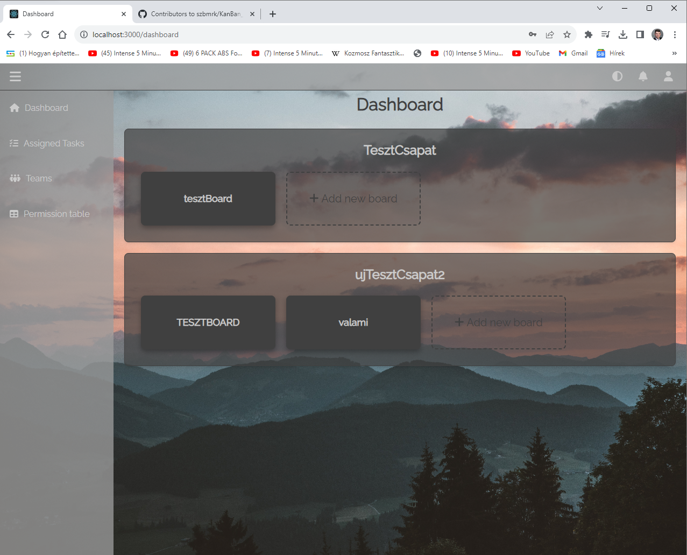
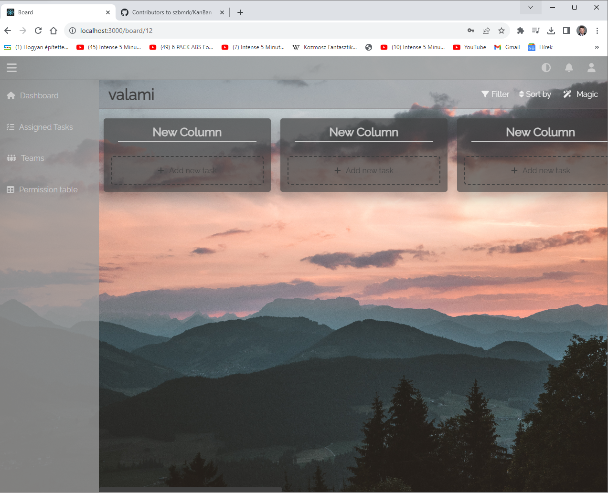
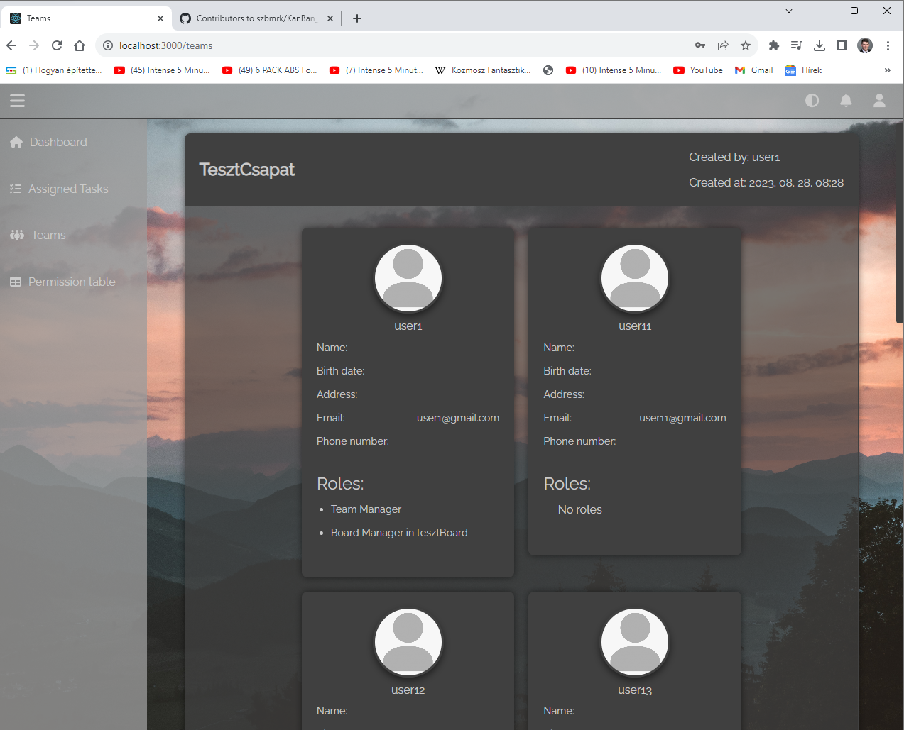
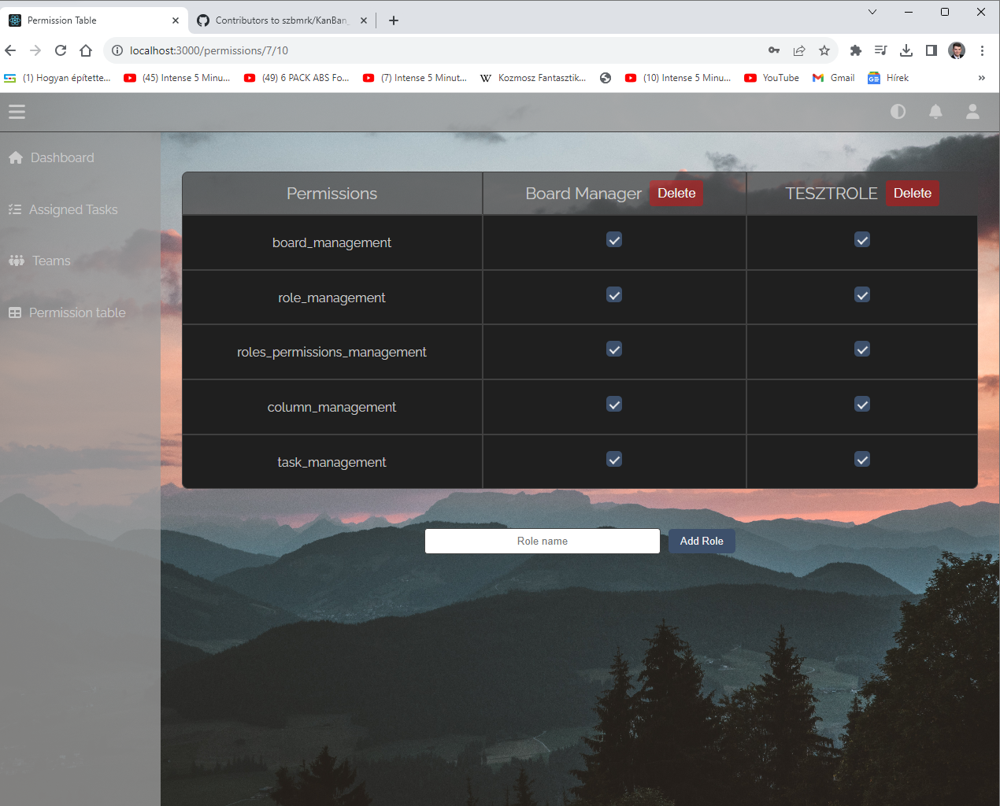
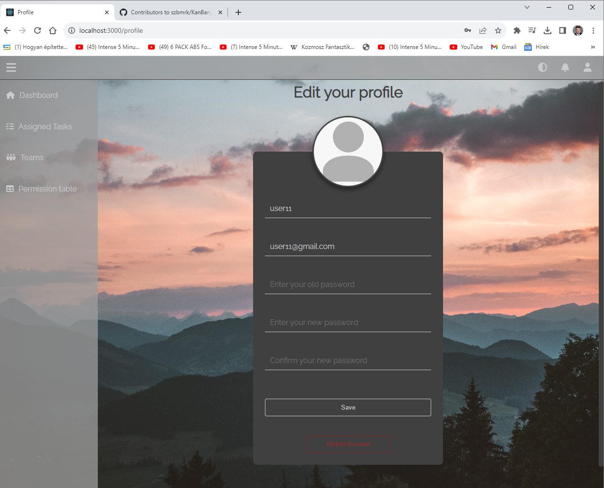

# Kanban Board Funckionális Specifikáció

## 1. Bevezetés

### 1.1 A Kanban Board
A Kanban Board egy teljes verziójú Kanban feladatkezelő alkalmazás, amely felhasználóbarát felülettel rendelkezik, és lehetővé teszi a felhasználók számára a feladatok könnyű kezelését és nyomon követését.

### 1.2 Kanban Módszer
A Kanban módszer alapelve az, hogy a munkafolyamat minden lépéséhez egy virtuális tábla tartozik, amelyen a feladatok kártyákként vannak ábrázolva. Ezek a kártyák mozognak a táblán a folyamat különböző szakaszaiban, például a “Tervezés”, “Folyamatban”, “Kész” stb. oszlopokban.

### 1.3 Kanban Board Funkciói
A Kanban Board egy digitális megvalósítása ennek a módszernek. A projektmenedzsmentben és a szoftverfejlesztésben gyakran alkalmazzák. Néhány alapvető tulajdonsága:
- **Feladatok vizualizálása**: A Kanban Boardon minden feladat egy kártyaként jelenik meg. Ezek a kártyák tartalmazzák a feladat leírását, státuszát, felelősét stb. A kártyák mozgatása a táblán tükrözi a feladatok előrehaladását.
- **Átláthatóság**: A tábla segítségével mindenki láthatja, hogy mely feladatok vannak folyamatban, melyek készen vannak, és melyek még várnak.
- **Prioritások kezelése**: A Kanban Board lehetővé teszi a feladatok prioritásainak beállítását. A sürgős feladatokat előrébb lehet hozni a táblán.
- **Csapatmunka támogatása**: A csapat tagjai könnyen együttműködhetnek a feladatokon, és láthatják egymás munkáját.

### 1.4 Projekt Célja
A projekt esetében a Kanban Board célja, hogy egy hatékony és felhasználóbarát felületen keresztül segítse a felhasználókat a feladatok kezelésében. A dokumentáció további részeiben részletesen olvashat a rendszer funkcióiról, architektúrájáról és megtekintheti az adatbázistervet.

## 2. Jelenlegi helyzet leírása
A projekt kiindulási pontja a mindennapi szükséglet, hogy egy hatékony, könnyen kezelhető digitális feladatkezelő rendszerre van szükség a projektmenedzsment területén. A jelenlegi helyzetben felmerült az igény egy olyan platformra, amely lehetővé teszi a felhasználók számára, hogy átláthatóan és hatékonyan kövessék a projektek fejlődését, és könnyedén kommunikáljanak a csapatukkal.

## 3. Vágyálomrendszer leírása
A Kanban Board projekt vágyálomrendszerének célja egy olyan digitális felület kialakítása, amely lehetővé teszi a felhasználók számára a könnyű és interaktív projektkezelést, miközben a fejlesztés és módosítások egyszerűségét is biztosítja. Az oldalnak emellett intuitívnak és könnyen használhatónak kell lennie minden felhasználó számára, beleértve azokat is, akik kevésbé jártasak az informatikai világban.

## 4. Jelenlegi üzleti folyamatok modellje
A Kanban Board projekt új üzleti folyamatai egy digitális projektmenedzsment eszközt hoznak létre, amely átláthatóságot, hatékonyságot és könnyű együttműködést biztosít a csapatok számára. A projekt célja, hogy felülmúlja a jelenlegi módszerek korlátait és javítsa a projektkezelés hatékonyságát.

## 5. Igényelt üzleti folyamatok modellje
A projekt igényelt üzleti folyamatai egy mobilis és rugalmas projektmenedzsment alkalmazást eredményeznek, amely ötvözi a projektkezelés funkcionalitását és a szórakozást a felhasználók számára. A rendszer tervezése során kiemelten kezeljük a könnyű elérhetőséget, a kollaborációt és a bővíthetőséget.

## 6. Követelménylista
- Felhasználói fiók létrehozása és kezelése.
- Projektek és feladatok létrehozása, szerkesztése, törlése.
- Feladatok státuszának és prioritásának kezelése.
- Csapattagok meghívása és kezelése.
- Jogosultságok és szerepkörök kezelése.
- Felhasználói értesítések.
- Reszponzív dizájn.

## 7. Használati esetek
1. **Bejelentkezés és regisztráció**
   - Felhasználó regisztrál az alkalmazásba.
   - Felhasználó bejelentkezik a meglévő fiókjával.
2. **Projekt létrehozása és kezelése**
   - Felhasználó új projektet hoz létre.
   - Felhasználó szerkeszti vagy törli a projektet.
3. **Feladatok kezelése**
   - Felhasználó új feladatot hoz létre egy projektben.
   - Felhasználó módosítja a feladat állapotát és prioritását.
4. **Csapattagok kezelése**
   - Felhasználó meghívja a csapattagokat egy projekthez.
   - Felhasználó kezeli a csapattagok jogosultságait.
5. **Jogosultságok kezelése**
   - Adminisztrátor szerkeszti a szerepköröket és jogosultságokat.
6. **Felhasználói értesítések**
   - Felhasználó értesítéseket kap a projektjeiről és feladatairól.

## 8. Képernyőtervek

### Belépés

### Regisztráció

### Dashboard

### Board

### Teams

### Permission table

### Edit profile

## 9. Forgatókönyvek

1. A felhasználó bejelentkezés után a főoldalon találja magát, ahol alapértelmezetten a dashboard jelenik meg, ahol az általa hozzáférhető táblákat látja.
2. Egy board kártyára kattintva az oldal átnavigál a /board útvonalra.
3. Az "Add new card"-ra kattintva új oszlopot hoz létre.
4. Az oszlop nevére duplán kattintva át tudja nevezni.
5. Az "Add new task" gombra kattintva tud új feladatot létrehozni.
6. A navbar-on található profil gombra kattintva megjelenik egy dropdown.
7. Az "Edit profile" menüre kattintva átnavigál a /editprofile oldalra.
8. A /editprofile oldalon tudja szerkeszteni az adatait.
9. A navbar-on található értesítések gombbal átnavigál a /notifications oldalra.
10. A /notifications oldalon láthatók az értesítések.
11. A sidebar-on a /teams menüben tud új csapatot létrehozni.
12. A csapat neve melletti menüben tudja a csapat nevét, a csapat tagokat módosítani és a csapatot törölni, ha van ehhez joga.
13. A sidebar-on a "Permission table" menüben tudja megtekinteni azokat a táblákat, amelyeken joga van módosítani a jogosultságokat és a szerepköröket.
14. A táblára kattintva jelennek meg a szerepkörök és a hozzájuk tartozó jogosultságok.

## 10. Funckió - követelmény megfeleltetése

## 11. Fogalomszótár

- **publikálás**: nyilvánossá tétel
- **regisztráció**: jelentkezés, beiratkozás
- **formázott szöveg**: szöveg, ami írható vastagon, dőlten vagy áthúzva.
- **navbar**: az oldal tetején található sáv
- **sidebar**: az oldal bal oldalán található sáv
- **bemenet**: a szövegdobozokba átadott információ

## 12. Kanban Board

A Kanban Board egy projektmenedzsment eszköz, amely vizuális táblázatokat használ a feladatok követésére és kezelésére. A projekt folyamatai oszlopokba vannak szervezve, és a feladatok kártyákként jelennek meg, amelyek az oszlopok között mozognak az előrehaladás során.

## 13. UI (Felhasználói Felület)

A Kanban Board projekt UI (felhasználói felülete) a rendszer által nyújtott vizuális felület, amely lehetővé teszi a felhasználók számára a projektjeik és feladataik hatékony kezelését. A UI feladata, hogy felhasználóbarát és könnyen navigálható legyen.

## 14. Reszponzív

A Kanban Board projekt reszponzív tervezése lehetővé teszi, hogy a felület mérete automatikusan alkalmazkodjon az eszköz képernyőjéhez. Így biztosítva a felhasználók számára optimális megjelenést és használhatóságot különböző eszközökön, például számítógépen, táblagépen vagy mobiltelefonon.

## 15. Free of Charge (Ingyenesen Használható)

A Kanban Board projekt ingyenesen használható, ami azt jelenti, hogy a felhasználóknak nem kell fizetniük a szolgáltatásért. Az alapvető funkcionalitások, mint például a projekt- és feladatkezelés, elérhetőek ingyenesen a felhasználók számára.

## 16. Kártya

A Kanban Board projektben a kártyák a feladatokat vagy projekteket reprezentálják. Ezek a kártyák mozognak az oszlopok között, tükrözve a feladatok állapotait és folyamatát.

## 17. Osztályozás és Szűrés

A Kanban Board projekt lehetőséget biztosít a feladatok és projektek könnyű kategorizálására és szűrésére. Ez segíti a felhasználókat abban, hogy könnyen megtalálják a számukra releváns információkat.

## 18. Kollaboráció

A projekt csapattagjai közötti hatékony kommunikáció lehetővé teszi a feladatokról és projektekről szóló információk megosztását. A kollaborációs eszközök segítik a csapatok együttműködését a projekt teljesítése érdekében.

## 19. Rugalmasság és Testreszabhatóság

A Kanban Board projekt rugalmasságot és testreszabhatóságot kínál a felhasználóknak. Az oszlopok és kártyák személyre szabhatók a projekt egyedi igényei szerint, így alkalmazkodva a különböző projektekhez és csapatokhoz.
